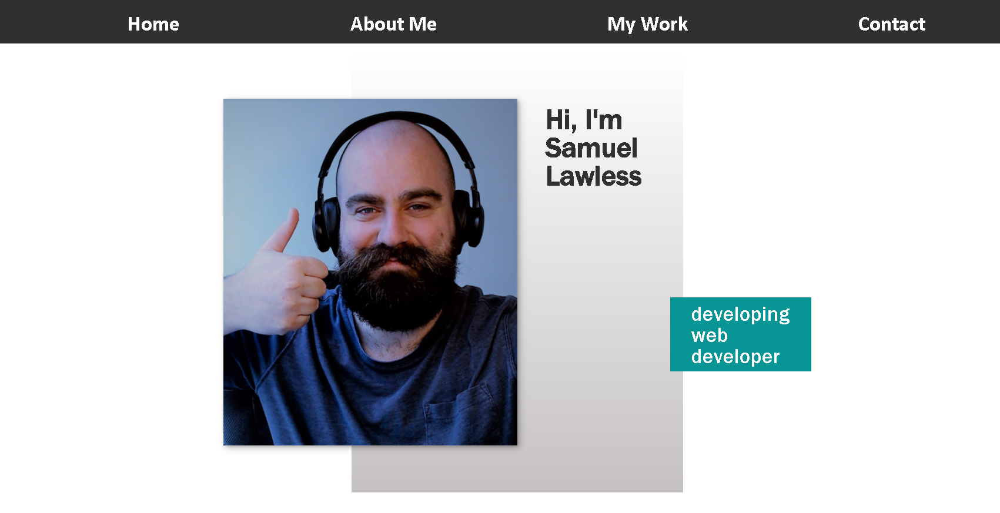

# Homework 2
## Description
The overall goal of this homework was to apply my first two weeks of learning html and css to make a functional front end draft web developer portfolio website. I reinforced many skills including: using flexbox, apply media queries, apply links for navigation within html, and much more. This is very much a draft website. It is not perfect, but it is a good start for me! 
## Link and screenshot
Whttps://slawless08.github.io/homework2/

## Items coming soon! 

Several aspects of this website are coming soon.
1. There is a placeholder image of where a linked image to my applications will go
2. The bigger picture will be my first and/or best application
3. The contact form will eventually be sent to my email
4. The "Who I am" section will contain relevant information including possibly services I may be offering
5. My logo and image will be my own and professionally done eventually

## Code Structure
One big aspect I focused on during this assignment was how I structured my code. Thanks to YouTube videos, I found a system that I think makes a lot of sense and will help me organize future projects. 
1. Classes were used for section titles and subtitles, but also for each individual section. This made styling each section flow much easier and can be easily changed in the future
2. Comments were made in both the html and the css organizing what is being coded

## Things to improve for next time
In the future, I would like to make my site more responsive. I would also like to change the navigation based on the screen size like having a button that brings out the navigation menu. The footer and form will need to be more stylized. Also, in the my work section, there is some more work to be done to get the items to lined up nicely. 

Thanks for reading :) 
